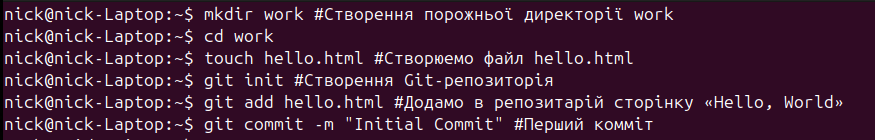

# Проходження інтерактивного курсу «Git How To»

## Частина 1
Створюємо репозиторій та робимо перший коміт

Робимо зміни у репозиторій та комітемо їх
![[Screenshot from 2025-05-05 19-22-11.png]]

Переглядаємо історію та переходимо між комітами
![[Screenshot from 2025-05-05 19-32-40.png]]

Створення тегів та перемикання за ім'ям
![[Screenshot from 2025-05-05 19-39-49.png]]

Скасування змін у файлах та відновлення області показу
![[Screenshot from 2025-05-05 19-47-39.png]]

Скасування коміта
![[Screenshot from 2025-05-05 19-51-32.png]]

Видалення комітів з гілки
![[Screenshot from 2025-05-05 19-59-11.png]]

Внесення змін до останнього коміта
![[Screenshot from 2025-05-05 20-10-36.png]]

Створення гілки та перемикання гілок
![[Screenshot from 2025-05-05 20-18-34.png]]

Перегляд розбіжних гілок та злиття
![[Screenshot from 2025-05-05 21-50-20.png]]

Створення та вирішення конфлікту
![[Screenshot from 2025-05-06 15-27-53.png]]
![[Screenshot from 2025-05-06 15-28-13.png]]

Використання `rebase`
![[Screenshot from 2025-05-06 15-40-53.png]]

